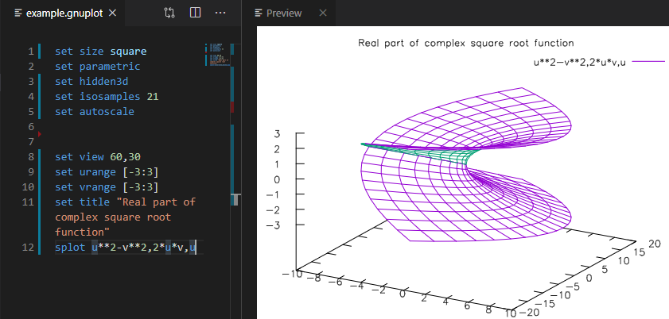

# Gnuplot Preview  for Visual Studio Code

A extension which provides gnuplot language support and enables visualization of gnuplot figures. The language support part is copied from another extension, [Gnuplot](https://marketplace.visualstudio.com/items?itemName=mammothb.gnuplot).

Make sure you have added the directory containing gnuplot binary to **PATH** environment variable and restart VS Code before using this extension.

## Features

### View figure on-the-fly

Just open your gnuplot script and use command `gnuplot.view`. Preview panel will refresh automatically everytime your file is saved.

### Error Message Parser

### Syntax highlighting

### Snippets

## License

MIT
